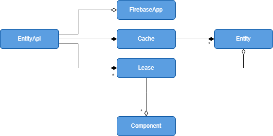

# Key Concepts

Before digging into details of the `react-firebase-state` library, there are
several key concepts that you should understand, as illustrated in the following
conceptual model.

## Entity
We use the term `Entity` for any data object, whether server-side or client-side.
React components use these objects to render views of the data.

## Cache
Entities are stored in a local `Cache` managed by an `EntityClient`.

## Lease
Certain entities, such as data objects from Firestore documents, are governed by a `Lease`.
The Lease maintains a ledger of all the components that require the Entity for rendering. 
When a component is added to the ledger, we say that the component *claims* the associated
Entity.  When a component is removed from the ledger we say that its claim has been *released*.

Components claim entities by invoking `useEntity`, `watchEntity` or `setLeasedEntity`.

Components typically release all claims by calling `releaseEntities` in a `useEffect` hook that fires
when the component unmounts.  A component may also invoke `releaseClaim` to release a specific claim.

A leased entity remains in the cache as long as there exists at least one component that claims
the entity.  When there are no more claims, the entity is not evicted from the cache immediately.
Instead, the entity will remain in the cache for a certain amount of time until it is 
garbage collected. The amount of time that an unclaimed entity remains in the cache is given by 
the `cacheTime` configuration parameter which is set to five minutes by default.

The policy of keeping unclaimed entities in the cache for a certain amount of time means that the
user may navigate away from a component briefly and then come back and the required entities will
still be available immediately without having to fetch them again from the server.

When the user navigates back to the component, a new claim is established, and consequently the leased 
entity is no longer eligible for garbage collecting.

## Component

The discussion above assumes that components are React components, and that is usually true but 
not strictly required. Leases reference components by name.  You can give a name to any logical part 
of the application and arrange for that part to claim entities.

A component that has a claim on some entity is called a *leasee*.

## EntityClient

An `EntityClient` is responsible for managing the Cache and the Leases.  It also maintains a
reference to the FirebaseApp object.

## EntityApi
The `EntityApi` provides access to the `EntityClient` and provides methods for updating the
entities in the cache.

## LeaseeApi
The `LeaseeApi` extends the `EntityApi` interface by providing a reference to a particular
leasee. This is useful when making changes to the cache in callback functions.

